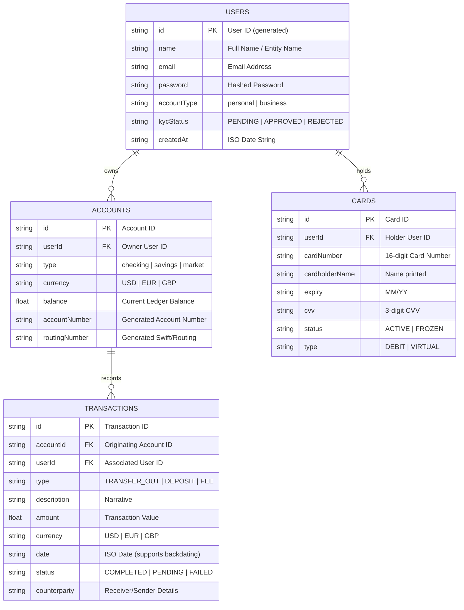

# Database Schema & API Specifications

## 1. Database Schema Design (JSON Database Entity Model)

Since the system is designed to run on a fast, lightweight, and highly portable architecture, it uses a unified JSON file database (`db.json`) structured as follows:



---

## 2. API Endpoints Specification

### A. Authentication & Onboarding
- **`POST /api/auth/register`**
  - **Description:** Registers a new personal/business client.
  - **Request Body:**
    ```json
    {
      "name": "Jane Doe",
      "email": "jane@company.com",
      "accountType": "business"
    }
    ```
  - **Response (201 Created):**
    ```json
    {
      "message": "Registration successful",
      "userId": "MTB-823901",
      "password": "temporary_password"
    }
    ```

- **`POST /api/auth/login`**
  - **Description:** Authenticate client and return session context.
  - **Request Body:**
    ```json
    {
      "userId": "MTB-823901",
      "password": "temporary_password"
    }
    ```
  - **Response (200 OK):**
    ```json
    {
      "message": "Login successful",
      "user": { "id": "MTB-823901", "name": "Jane Doe", "accountType": "business", "kycStatus": "APPROVED" }
    }
    ```

### B. Accounts & Wallets
- **`GET /api/accounts?userId={userId}`**
  - **Description:** Retrieve all checking, savings, and money market account balances in USD, EUR, and GBP for a user.
  - **Response (200 OK):**
    ```json
    [
      { "id": "ACC-101", "type": "checking", "currency": "USD", "balance": 50000.00, "accountNumber": "12239088", "routingNumber": "MTBUSD2X" }
    ]
    ```

### C. Transactions & Backdating
- **`GET /api/transactions?userId={userId}`**
  - **Description:** Get all transactions for a specific user, sorted in descending order of transaction date.
  - **Response (200 OK):** List of transaction objects.

- **`POST /api/transactions/send`**
  - **Description:** Initiate an outbound wire. Allows passing a custom backdate.
  - **Request Body:**
    ```json
    {
      "userId": "MTB-823901",
      "accountId": "ACC-101",
      "amount": 2500.00,
      "currency": "USD",
      "counterparty": "Apex Systems Corp",
      "description": "Software services payment",
      "date": "2026-03-01T10:00:00.000Z"
    }
    ```
  - **Response (200 OK):**
    ```json
    { "message": "Transfer processed successfully", "transactionId": "TXN-902183" }
    ```

- **`POST /api/transactions/receive`**
  - **Description:** Simulate incoming funds. Supports custom dates for historical backdating.
  - **Request Body:** Same parameters as transfer, credits the specified account.

### D. Card Program
- **`GET /api/cards?userId={userId}`**
  - **Description:** Fetch physical and virtual cards.
- **`POST /api/cards/toggle`**
  - **Description:** Freeze/unfreeze card.
  - **Request Body:** `{ "cardId": "CRD-901" }`
- **`POST /api/cards/create`**
  - **Description:** Dynamically create a new virtual card.

### E. Administration Dashboard (Secure Routes)
- **`GET /api/admin/users`** - List all registered bank clients.
- **`POST /api/admin/user/kyc`** - Update KYC status (`APPROVED`/`REJECTED`/`PENDING`).
- **`POST /api/admin/user/adjust-balance`** - Manually adjust account ledger balances.
- **`POST /api/admin/transactions/modify`** - Manually update, delete, or create transaction ledger entries.
