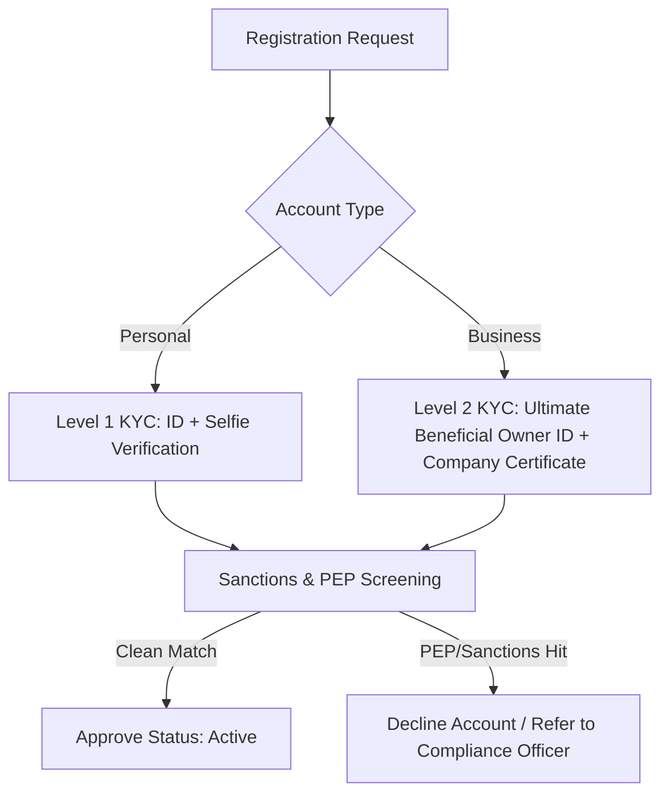

# Risk Management & Compliance Framework

As an offshore digital bank catering to startups and global business entities, **Meridian Trust Bank** enforces a multi-layered Risk Management Framework designed to prevent money laundering, terrorist financing, fraud, and system exploitation, while maintaining high liquidity ratios.

---

## 1. Customer Identification & Verification (KYC)

Clients are categorized into risk tiers upon registration. Account opening is subject to automated and manual document verification.

### KYC Levels
1. **Level 1 (Personal Accounts):**
   - Government-issued photo ID (Passport, National Identity Card).
   - Live Selfie Match with biometric check.
   - Proof of address (Utility bill, bank statement less than 90 days old).
2. **Level 2 (Business Accounts):**
   - Certificate of Incorporation & Memorandum of Association.
   - Register of Directors and Register of Shareholders.
   - Level 1 KYC verification for all Ultimate Beneficial Owners (UBOs) holding $\ge 25\%$ shares.
   - Corporate resolution to open bank account.

---

## 2. Anti-Money Laundering (AML) & Transaction Monitoring

We maintain transaction monitoring limits to detect suspicious activity:

- **Single Transaction Limit:** Personal ($15,000 USD equivalent); Business ($250,000 USD equivalent).
- **Daily Transaction Velocity:** Personal ($50,000 USD limit/day); Business ($1,000,000 USD limit/day).
- **Suspicious Activity Triggers:**
  - Round-trip transactions (e.g., receiving funds and sending them out within 30 minutes to different accounts).
  - Rapid balance accumulation followed by immediate cash-out or card spending.
  - Transactions involving high-risk jurisdictions (Iran, North Korea, Belarus, Russia, etc.).
- **Reporting Protocol:** All flagged transactions are routed to the internal admin panel for Compliance Officer review. If confirmed suspicious, a Suspicious Activity Report (SAR) is generated and forwarded to the local Financial Intelligence Unit (FIU).

---

## 3. Offshore Reserves & Liquidity Risk Management

To maintain absolute depositor confidence, Meridian Trust operates on a **100% full-reserve banking model** for all liquid balances, rather than fractional reserve:

- **Liquid Reserve Allocations:**
  - 85% of client deposits are kept in short-term US Treasury Bills (1-3 months maturity) or AAA-rated cash equivalents.
  - 15% of deposits are kept in highly liquid settlement accounts at top-tier clearing banks (Fedwire/Target2 agents) to process daily outbound wires.
- **Credit Risk:** Meridian Trust does **not** engage in unsecured retail lending or mortgage financing. This eliminates bad debt risk and ensures depositors can withdraw their entire balance at any time.
- **FX Volatility Management:** Multi-currency exposures are hedged dynamically on the wholesale interbank market to neutralize FX variance.
